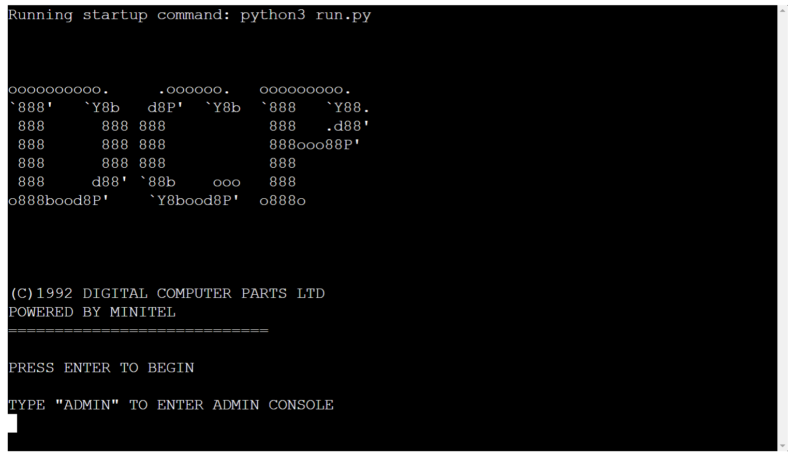

# Site Overview
The name of my Code Institute PP3 app is "Digital Computer Parts LTD". It is a pre-HTML style networked service aimed at computer enthusiasts who wish to put together a parts list for a future build. I wanted to create an app based on my memory/knowledge of the functionality, feel and design of ancient pre-modern Internet services, as I find them quite charming and nostalgic. I also just wanted to create an app where I could write lots of pointless intricacies about hardware and still get graded on it.

# Table of Contents
* [Technologies Used](#technologies-used)
* [Resources](#Resources)
* [Libraries](#libraries)
* [User Stories](#user-stories) 
* [Overview](#Overview)
    * [Flowchart](#flowchart)
    * [Technical Features](#technical-features)
    * [Future Features](#future-features)
* [Testing](#testing)
    * [Manual Testing](#manual-testing)
* [Validator](#validator)
* [Bugs](#bugs)  
    * [Known Issues](#known-issues)
* [Deployment](#deployment)
    * [How to Fork](#how-to-fork)
* [Credits](#credits)  

------

# Technologies Used
- [Python](https://www.python.org/) for the code
- [Heroku](https://www.heroku.com/) for deployment
- [Github](https://github.com/) for file management & version control 
- [Gitpod with VSCode](https://www.gitpod.io/) for code editing and pushing commits
- [Sublime Text](https://www.sublimetext.com/) as a backup editor whenever I felt the need for it.

# Resources
- [Code Institute](https://codeinstitute.net/) Course material & the Slack community 
- [W3Schools]( https://www.w3schools.com/) as reference material
- [StackOverflow](https://stackoverflow.com/) I never get through any project without looking at StackOverflow at least once.
- [CI Python Linter](https://pep8ci.herokuapp.com/) for error checking/code validation
- [GSpread Documentation](https://docs.gspread.org/en/v5.7.1/) Invaluable for figuring out how to perform certain functions.

# Libraries

- [os](https://docs.python.org/3/library/os.html/) - For detecting whether the user is on Windows or Unix/BSD

- [sys](https://docs.python.org/3/library/sys.html) - System-specific parameters and functions

- [time](https://docs.python.org/3/library/time.html) - for implementing a sleep delay function, initially to avoid rate-limiting but now it's just for show.

- [pyfiglet](https://pypi.org/project/pyfiglet/0.7/) - for generating attractive ASCII text

- [PrettyTable](https://pypi.org/project/prettytable/) - for displaying data in a neat little table

- [gspread](https://docs.gspread.org/en/v5.7.1/) - for interfacing with the Google Sheets API

# User Stories

-   As a user I want to purchase computer hardware
-	As a user I want to be able to easily navigate through the app
-	As a user I want to know pertinent info about my hardware - the amount of flash memory it has, its frequency, how many cores, etc.
-	As a user I want to know stock data - how many of a particular item are in stock and how much do they cost.
-	As an administrator I want to be able to update stock data - maybe several were destroyed in a flood or a power surge, maybe ten new items arrived in, etc.
-   As an administrator I want to update pricing data
-   As an administrator I want to update the descriptions of items
-   As an administrator I want to keep my backend safe from the general public

# Overview

This app is intended as a sort of primitive precursor to sites like https://pcpartpicker.com/ - you select a list of parts, and then check out with them
once you have selected sufficient parts to make up a functional computer build.

This app contains two main areas: the user-facing main menu, and the administrator-facing backend console.

The user cannot "update" any of the backend data, only select it and modify the quantity in downward increments of one.

Currently, you can view and select from a list of processors, graphics card, RAM memory modules, and hard drives - obviously in the real world you
would also need a motherboard, power supply, case, etc etc - but for the sake of simplicity I have only listed the four most important objects.

The live app is hosted here: https://partslistapp.herokuapp.com/

The admin credentials are as follows:

* Username: ulaidh
* Password: dundalklouth

Alternatively, you can also use:

* Username: root
* Password: xY48428z!#2q

## Flowchart

This flowchart helped me on my way with planning and carrying out this project work.

## Technical Features

* Display logo in cute ASCII text format.

* Display data in a cute ASCII tabulated format - data from the spreadsheet regarding CPUs, GPUs, RAM and HDDs is displayed in a neat table.

* Input listener - the app keeps track of whether and how many times you have selected a particular part, and runs a results screen once all four options have been selected.

* Input validation - All the various input fields are checked for invalid inputs and the result of the input will not be passed if it does not match the field type or the requirements of the input box.

* Subtotal checker - the app has a function for checking what parts have been selected, and the current subtotal price.

* Quantity validation - if a part is out of stock, the user cannot add it to their basket. When the user selects a part, the quantity of the part is dynamically updated in both the spreadsheet and in the terminal interface.

* All cells previously updated in relation to the prices of items selected by the user are set back to 0.00 whenever the app is restarted.

* All pertinent data can be updated from the App itself in the admin console - you can update the description, price, or quantity for any given entry.

* Admin account validation - when a username and password are inputted, both are checked against a list of pre-defined usernames and passwords - if both match, the admin may proceed, if not, they are either asked to re-input their credentials if either the username or username and password are wrong; or re-input their password if the password is wrong but the username is correct.

* Easter egg - the app has a function which "bans" you if you do something which the fictional administrator considers too annoying.

## Future Features
There are more features which I would have liked to add if I had the time, the proficiency, or if the scope called for them. 

* I would have liked to have implement masking for the password input (e.g 123456 becomes ******) but I could not find a native way to do this and did not feel like importing extra packages - it didn't feel like a good use of my limited time.

* I would have liked to input a text ticker where lines are generated character by character - but there was no native way of doing it, I did not precisely understand the method being used by people on StackOverflow to perform this aesthetic feature, and finally it did not seem like a productive use of limited time so I left it out.

* I would have liked to introduce a "compatibility check" e.g you cannot use DDR3 memory with a 10th Gen Intel Processor, cannot use a 3dfx VooDoo with any modern processor, etc - but this would add to the complexity significantly and I wasn't comfortable enough at the time with Python to build a sort of logic map for how that would have worked.

* I would have liked to add in an option on the admin backend to "add" new products entirely rather than being limited to a few entries - but I was concerned for half the project about rate-limiting affecting my final submission and then the idea slipped my mind at the end. I am aware of how to do it for future projects.

* I would have liked to add in quantity validation in the opposite direction - if the user changes their parts selection midway through the decision process, the quantity of the last part they selected will go back up to what it was previously - however I am not exactly sure how to do this and it is not 100% necessary.

# Design

I had Minitel terminals and old pre-Web online services such as BBS in my mind. 

I find the primitive graphics quite charming - my apologies if you are old enough to actually remember using these services - I grew up just at the introduction of ADSL broadband but with a load of ancient computer hardware such as a Minitel terminal, an IBM XT Machine, a ZX81 Spectrum etc lying around from my Dad's old collection and I found them simply fascinating.

# Testing 

## Manual Testing

Manual testing was done on a self-built Desktop with an Intel Core i3-10105F, 24GB of DDR4 memory, a 250GB SSD and a GeForce GTX1650, running Google Chrome on Windows 10 Pro 21H2.

I tested it myself and also got a friend to test it, and after much time spent going over the input validation loops, I could not manage to make it produce any errors.

Feature Tested | Expected Result | Actual Result | Pass/Fail
---------------|-----------------|---------------|----------
Admin/user login prompt | When either ADMIN or admin is typed, should bring you to the Admin login screen. Else, proceed to normal main menu. | As expected | Pass
Admin login screen | If the username and password match entries from the pre-defined array, you will be allowed progress into the Admin screen of the app. | As expected | Pass
Menu options | Should bring you to different parts/functions of the app. | As expected | Pass
Exit buttons | When called by typing their number or "exit" as the case may be, should bring you one step backwards. | As expected | Pass
Description edit function | When called in relation to a specific entry in the spreadsheet, should provide the user with an input box and THEN send the inputted data to replace the existing data in the previously called specific entry in the spreadsheet. | As expected | Pass
Quantity edit function | When called in relation to a specific entry in the spreadsheet, should provide the user with an input box and THEN send the inputted data to replace the existing data in the previously called specific entry in the spreadsheet - so long as the input is a whole number e.g "4" "80" "85538" and not "5.7" or "fjdiFE$942!!!!###". Else, input fails and the user is alerted to only input numbers. | As expected | Pass
Price edit function | When called in relation to a specific entry in the spreadsheet, should provide the user with an input box and THEN send the inputted data to replace the existing data in the previously called specific entry in the spreadsheet - so long as the input is a whole number or a decimal point number - eg "40" or "37.53" is fine but "fjdiFE$942!!!!###" is rejected and the user is alerted that they cannot enter this. | As expected | Pass
Menu logos | Breaks up the monotony somewhat. | As expected | Pass

## Browser Testing 
Browser Tested | Working Status
---------------|---------------
Chrome | Works as expected
Firefox | Works as expected
Microsoft Edge | Works as expected

## Device Testing
Device Tested | Working Status
--------------|---------------
Xiaomi Redmi Note 8 | Works as expected
Dell Latitude E5470 | Works as expected

# Validator

I utilized the linter already included with Gitpod the whole way through the project.

I also utilized autopep8 to clean up any latent issues which I couldn't fix manually/which would have taken too long (see for example!)

Additionally, my run.py file passed CI linting without any errors.

# Bugs

* I utilized the "problems" tab on Gitpod to monitor any syntax issues.

* I utilized print() to test whether codeblocks were producing the desired output or not.

* In the early stages, due to my familiarity with Javascript I kept getting caught out by the fact that "if" and "else" statements in Python have to be followed by a colon ":" which would then throw up syntax errors which at first seemed to be for no discernable reason - until I realized my mistake.

* It's always good to brush up on Maths because I for one kept getting caught out additionally by the fact that int() (integer) only accepts whole numbers (40) and if you want to use decimals (39.99), you should go for float() (floating-point number).

* When trying to produce a visual result for an int var, I would get an error "cannot concatenate int to str" - this was solved by wrapping the int in str() to convert it to a string to stop Python from thinking it has to do a maths operation between "The " and "75".

* Eternal bane of my life, the indentation rules of Python where it feels as if one single space out of place in a line of code can ruin an entire codeblock. Careful visual inspection and autopep8 remedies this.

* Midway through my project I kept getting rate-limited by Google Sheets - this as I later figured out was because I was pulling data from my sheets very inefficiently - I called each individual row/column of data as I needed it instead of performing one single operation to pull the entire table and display it with something like PrettyTable(). Regardless, at the time, adding time.sleep(secs) assisted in reducing rate-limit errors.

* Another significant bug for me was figuring out how to make "global" variables as it's comparatively very easy to do this in Javascript - almost too easy.
In the case of Python, I had to first declare the existence of the variable at the top of the document in ALL_CAPS, then declare it as GLOBAL ALL_CAPS in the codeblock where I needed to use it - this ensured I could modify it inside and outside of nested codeblocks and functions and ensure it still had the same value as was last assigned to it, no matter where in the code the value had been re-assigned.

* A very silly one - I wrote a function which included an explicit "print(var, args)" at the end of it and THEN afterwards I did "print(my_function)" - it worked okay but it kept throwing up "None" at the final line and I pored over reams and reams of Google searches and Stackoverflow and the Slack and whatnot trying to figure out how to "mute" this 'None' output or hide it or rename it - eventually I found a similar enough problem where someone explicitly told the asker "this is happening because you're telling it to print(print(var, args)) - it's redundant, get rid of it."

## Known Issues

The code for my admin console for updating descriptions, quantities or pricing does not produce any errors but it is quite repetitive in a bad way - If I could figure out how to dynamically assign a cell reference, I would tidy this up significantly and contain the repetitive code in one single function - but I cannot figure out how to capture a cell reference e.g E5, pass it to a var, and then use that var as a cell reference e.g acell.update(my_cellref, new_quantity) - when I tried to implement this, it simply threw up an error as follows:

> gspread.exceptions.APIError: {'code': 400, 'message': "Unable to parse range: 'cpus'!'E1'", 'status': 'INVALID_ARGUMENT'}.

I did try very hard to google this by reducing the error to its most common compoments, but I could not find anyone trying to do what I did - perhaps there's a better way to do it, and I wish I knew it and I had the time to rectify this.
    
  

# Deployment
The app was deployed to Heroku. Below is the process I followed:

Important prerequisite: In the terminal, run "$ pip freeze > requirements.txt" to inform Heroku what dependencies are required.
Further: if you have installed autopep8 at some point, remove the 'pipfile' and 'pipfile.lock' that it generates or else
your project will not deploy properly on Heroku as it will refer to these instead of requirements.txt for dependencies.

Further, I had issues getting it to deploy at all with Python 3.8 on the Heroku 22 stack - this was rectified by downgrading the stack to Heroku 20.

Otherwise, the basic process is as follows:

1. Create a Heroku account
2. Choose Python as the primary development language
3. Click the 'Create New App' button
4. Name the application
5. Add the Python and nodejs buildpacks in the settings menu
6. Link your GitHub repository with Heroku on the deployment tab
7. Finally, 'Deploy Branch'.

## How to Fork
1. Login/signup to [GitHub](https://github.com/).
2. Locate my repository - in this case [jakob-bren/python-proj-3](https://github.com/jakob-bren/python-proj-3)
3. Click on the 'Fork' button in the upper right.
4. A forked version of my repoitory will appear in your own list of repositories.

# Credits

* I looked over PP3 projects made by past pupils for inspiration on how they did things and solved problems - this led to me discovering pyfiglet and PrettyTable, for instance, and also majorly helped me get out of a rut where I had no clue what I should even make.

* I also referenced a lot of disparate StackOverflow articles for explanation of how to create individual codeblocks to perform xyz function, such as [this](https://stackoverflow.com/questions/62506229/what-is-the-difference-between-sys-exit-and-break-in-python) for exiting codeblocks and the program itself cleanly, or [this](https://stackoverflow.com/questions/51662467/using-a-global-variable-inside-a-function-nested-in-a-function-in-python) for figuring out how to make global variables in Python.

